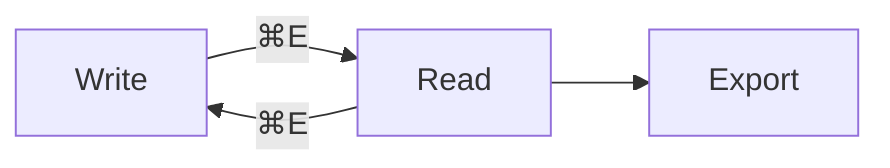

# Lineform Feature Showcase

A hands-on tour for manual QA. Two batches:

- **Part 1 — shipped 2026-07-26.** Mostly **Write mode** features. Stay in Write (**⌘E** toggles) and type in the scratch areas; this file is an untracked scratch fixture, so mangling it is expected.
- **Part 2 — shipped 2026-07-18.** Mostly **Read / Preview** features. Switch with **⌘E** when you get there.

Run sheet:

- [ ] List continuation on Return
- [ ] Live spell check + suppression regions
- [ ] Insert Table / Reformat Table / Tab between cells
- [ ] HTML export is one-to-one
- [ ] Heading levels ⌘1–⌘6, ⌘0, and press-to-clear
- [ ] Part 2 renders as it always did

---

# Part 1 · Shipped 2026-07-26 (Write mode)

## 1 · List continuation on Return

Put the caret at the end of a line below and press **Return**. The marker carries down. Press **Return** again on the empty marker it just made — the construct ends instead of stacking blanks.

Bullets:

- first bullet
- second bullet

Numbered — the number should increment, not repeat:

1. first item
2. second item

Task checkboxes — a new `- [ ]` should come down **unchecked** even from a checked line:

- [x] done thing
- [ ] pending thing

Blockquotes:

> quoted line, press Return at the end of me

Scratch area (type freely):

-

## 2 · Live spell check

Misspellings underline **as you type**, with no autocorrect changing anything under you. Right-click one: you get a single ranked suggestion plus **Learn Spelling** and **Ignore Spelling**. The off switch is **Edit ▸ Spelling and Grammar**.

Prose with deliberate errors — these **should** underline:

This sentance has a mispelled word and anoter one right after it, plus recieve and seperate for good measure.

Now the suppression regions. **None** of the identical misspellings below should underline:

Inline code: `this sentance is mispelled inside backticks and must stay clean`.

Fenced code:

```text
this sentance is mispelled inside a fence
recieve seperate anoter
```

Math (inline $\mathrm{sentance}_{\mathrm{mispelled}}$ and display):

$$
\text{sentance} + \text{mispelled} = \text{no underlines}
$$

Link and image destinations — the visible label may underline, the URL must not:

[a mispelled label](./sentance-mispelled-anoter.md)


Front matter can't be demoed mid-file — it only counts at the very top of a document. To check it, make a new file starting with `---`, put `titel: mispelled` inside, and confirm it stays clean.

## 3 · Table authoring

**Insert Table (⌃⌘T)** drops a 3×2 skeleton at the caret. Try it here:

**Reformat Table (⌃⌘R)** aligns the pipes of the table the caret is inside. Put the caret in this ragged one and press it:

| Feature | Shortcut | Notes |
|---|---|---|
| Insert Table | ⌃⌘T | 3×2 skeleton |
| Reformat | ⌃⌘R | aligns pipes under the caret |
| Cell nav | Tab / ⇧Tab | inside a table only |

Press **⌃⌘R** a second time on the now-aligned table: it should be a **silent no-op**, no flash, no edit, nothing on the undo stack.

Alignment colons must survive a reformat — `:--`, `:-:`, and `--:` here must **not** collapse to `---`:

| left | center | right |
|:--|:-:|--:|
| a | b | c |

Reformat must **refuse** on both of these (they'd be rewritten destructively). Put the caret in each and press ⌃⌘R — nothing should change:

| escaped pipe | value |
|---|---|
| a \| b | still one cell |

| backticks | value |
|---|---|
| `a \| b` | still one cell |

**Tab / Shift-Tab** move between cells *inside a table only*. Tab on this ordinary line must insert a tab, not jump anywhere:

tab here →

## 4 · HTML export

**File ▸ Export As ▸ HTML…** writes a copy; the open `.md` is untouched.

The export is **one-to-one with the source**: paths and URLs come out exactly as written — never resolved, rewritten, or inlined. Export this file and check the emitted markup against these four:

- Relative image: `` → stays `./assets/diagram.png`
- Absolute image: `` → stays absolute
- Remote image: `` → stays remote, never downloaded
- Link: [a relative link](../notes/draft.md) → stays `../notes/draft.md`

Only generated **math** and **mermaid** images embed — that's the one exception, and Part 2 has both to check.

## 5 · Heading levels (⌘1–⌘6, ⌘0)

Put the caret on a line and press a number. It **sets** the level of every line the selection touches — no stacking, no second `#`.

set me to a Title with ⌘1
set me to a Section with ⌘2
set me to Heading 3 with ⌘3
set me to Heading 6 with ⌘6

Press a line's **current** level again to clear it back to body text. **⌘0** does the same explicitly.

### press ⌘3 on me — I should become plain prose

Select all four of these at once and press ⌘2 — every line becomes a Section in one shot:

first
second
third
fourth

The menu split: **Title (⌘1)** and **Section (⌘2)** stay on the Format menu; **Heading 3–6** and **Body** live in **Format ▸ Heading**. All of them should show an SF Symbol icon — open the menu twice in a row, the icons must survive the second open.

These must be **skipped**, not converted. Select the whole block and press ⌘2 — only the prose line changes:

- a list item that must stay a list item
> a blockquote that must stay a blockquote

```text
a code line that must stay code
```

a plain prose line that SHOULD become a Section

Every heading you make should appear in the **outline sidebar**. If a line looks like a heading but the outline can't see it, that's the stacking bug back.

---

# Part 2 · Shipped 2026-07-18 (Read / Preview)

Press **⌘E** now — most of what follows only appears rendered.

## G · View-mode toggle (⌘E)

It flips between **Write** and **Read**. From Split it lands in Write. Split itself stays on the toolbar. That's the whole feature — a fast, one-key way to move between editing and reading.

---

## C · Code syntax highlighting + copy button

In **Read / Preview** each fenced block is colourized by a native tokenizer, and a **Copy** pill appears in the top-right when you hover. Try hovering one. Unknown languages stay plain monospace but still get the copy button.

### Swift

```swift
// A small greeting type
struct Greeter {
    let name: String
    func hello() -> String {
        let count = 3
        return "Hello, \(name)! " + String(repeating: "👋", count: count)
    }
}
```

### JavaScript / TypeScript

```ts
// Debounce a function by `ms` milliseconds
function debounce<T>(fn: (arg: T) => void, ms: number = 250) {
  let timer: number | undefined
  return (arg: T) => {
    clearTimeout(timer)
    timer = setTimeout(() => fn(arg), ms)
  }
}
```

### Python

```python
# Fibonacci up to n
def fib(n: int) -> list[int]:
    seq = [0, 1]
    while seq[-1] < n:
        seq.append(seq[-1] + seq[-2])  # running sum
    return seq
```

### JSON

```json
{
  "app": "Lineform",
  "version": "1.3.0",
  "features": ["callouts", "images", "read-aloud"],
  "aiInside": false
}
```

### Bash

```bash
# Package a release build
set -euo pipefail
VERSION="1.3.0"
echo "Building Lineform ${VERSION}…"
xcodebuild -scheme Lineform -destination 'platform=macOS' build
```

### HTML

```html
<!-- A minimal card -->
<article class="card">
  <h2>Calm writing</h2>
  <p>Real files. No cloud. <strong>No AI inside.</strong></p>
</article>
```

### CSS

```css
/* Quiet, readable body text */
.prose {
  max-width: 65ch;
  line-height: 1.6;
  color: #23201c; /* warm near-black */
}
```

---

## B · Callouts / admonitions

These render as a **monochrome title row** (an icon + label, no colour) over the quoted body. All five GitHub types:

> [!NOTE]
> This is a note. Use it for neutral, useful context while reading.

> [!TIP]
> You can give a callout a custom title, like this: `> [!TIP] Pro move`.

> [!IMPORTANT]
> Callouts are plain text — they degrade to an ordinary blockquote in any other editor.

> [!WARNING]
> An unrecognized type such as `[!FOO]` just renders as a normal blockquote.

> [!CAUTION]
> Nothing here touches the network or a database. It's all in the file.

---

## A · Inline local image rendering + Reconnect

An image **alone on its own line** with a **local** path renders the real picture in Read/Preview — block-only, **left-aligned** (like a diagram), never wider than the column and capped in height so a tall photo can't take over the page.

If that file isn't next to this document, you'll see the **🖼 placeholder with a "Reconnect" pill** instead — click it, pick any local image, and Lineform rewrites the link for you. Try it: it's the intended way to fix a moved or shared image. (Remote `http://…` images are never downloaded — they always stay a placeholder.)

xxxxxxxx


A broken/missing image shows the placeholder with a Reconnect pill:


An image *inside a sentence* like  stays a placeholder on purpose — images are block-only.

---

## D · RTF export &nbsp;·&nbsp; F · PDF styles

These live in the menus, not the page:

- **Rich Text (.rtf)** in **File ▸ Export As** — hand this document to someone on Word/Pages/Google Docs.
- **File ▸ Export As** also offers **HTML · PDF · Styled PDF**. **PDF** prints the raw markdown source (visible `#`, `**`); **Styled PDF** renders it the way Read mode does, carrying through your reading profile. Export this page both ways and compare. **⌘P** (Print) always uses the Styled look.
- **File ▸ Save As… (⌘⇧S)** is the different one: it retargets the `.md` file itself rather than writing a copy.

> [!TIP]
> Export this very document as **PDF** vs **Styled PDF** to see the two presets side by side.

---

## E · Read-aloud

Open **Edit ▸ Speech ▸ Start Speaking**. Lineform reads the *rendered* text aloud — it says "Hello" and this sentence, but it **skips the code blocks, math, and diagrams** below, and never reads the `#` or `*` symbols. Select a paragraph first to have it read only that.

---

## Everything still works too

A quick regression tour — these all predate both batches and should render as before.

### Tables

| Feature | Mode | Ships in export |
|---|:---:|---|
| Code highlighting | Read / Preview | Monochrome |
| Callouts | Read / Preview | Yes |
| Local images | Read / Preview | Placeholder (v1) |

### Task list

- [x] Design specs written
- [x] Built task-by-task with review
- [x] Merged to main
- [x] Your manual QA pass

### Math

Inline math like $E = mc^2$ and a display block:

$$
\int_{0}^{\infty} e^{-x^2}\,dx = \frac{\sqrt{\pi}}{2}
$$

### Mermaid



### Blockquote & emphasis

> Plain blockquotes still look like plain blockquotes — **bold**, _italic_, `inline code`, and ~~strikethrough~~ all render normally.

---

*Delete this file whenever you're done — it's just a demo and isn't tracked by git.